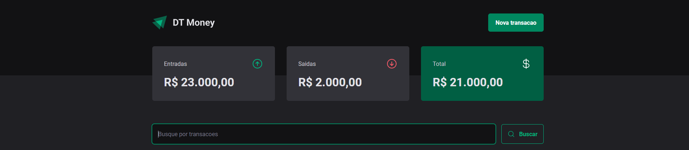

<p align="center">

  
  
  <a href="https://github.com/jsnevt/README-JSDT-Money/commits/master">
    
  </a>
    
   
   <a href="https://github.com/jsnevt/README-JSDT-Money/stargazers">
    
  </a>

  <a href="https://rocketseat.com.br">
    
  </a>
  
  <a href="https://blog.rocketseat.com.br/">
    
    </a>
  
 
</p>
<h1 align="center">
    
</h1>

<h4 align="center"> 
	🚧  DT Money -  Concluído 🚀 🚧
</h4>

<p align="center">
 <a href="#-sobre-o-projeto">Sobre</a> •
 <a href="#-funcionalidades">Funcionalidades</a> •
 <a href="#-como-executar-o-projeto">Como executar</a> • 
 <a href="#-tecnologias">Tecnologias</a> •  
 <a href="#-autor">Autor</a> • 
 <a href="#user-content--licença">Licença</a>
</p>


## 💻 Sobre o projeto

DT Money - é uma aplicação para simples registros de receitas e despesas. 

---

## ⚙️ Funcionalidades

- [x] Pessoas podem registrar suas receitas e suas despesas neste aplicativo simples.
	- A aplicação usa a biblioteca JSON-Sever que fornece dados fictícios para simular registros sema a necessidade de 
	- ter um backend implementado, permitindo que o desenvolvedor possa simular as operações sem depender do mesmo.

---


## 🚀 Como executar o projeto

O projeto foi feito usando o framework Vite com React 


### Pré-requisitos

Antes de começar, você vai precisar ter instalado em sua máquina as seguintes ferramentas:
[Git](https://git-scm.com), 
[Node.js](https://nodejs.org/en/). 
Além disto é bom ter um editor para trabalhar com o código como [VSCode](https://code.visualstudio.com/)


#### 🧭 Rodando a aplicação web (Frontend)

```bash

# No prompt de comando:
# Crie uma pasta onde desejar
# Acesse a pasta e no terminal

# Clone este repositório
$ git clone https://github.com/jsnevt/JSDT-Money.git

# Instale as dependências
$ npm install

# No VSCode, abra a pasta onde o arquivo foi clonado e abra o projeto

# Acesse o terminal do VS e execute a aplicação em modo desenvolvimento
$ Digite "npm run dev:server" (sem as aspas) - para iniciar o servidor backend(simulado pelo JSON-Server)

O backend da aplicação rodará na porta:3000

# Abra outro terminal e execute o comando abaixo:
$ Digite "npm run dev" - para roda a aplicação.

Acesse a aplicação através do link http://localhost:5173

```

---

## 🛠 Tecnologias

As seguintes ferramentas foram usadas na construção do projeto:

#### **Website**  ([React](https://reactjs.org/)  +  [TypeScript](https://www.typescriptlang.org/))

-   **[React Router Dom](https://github.com/ReactTraining/react-router/tree/master/packages/react-router-dom)**
-   **[Phosphor-react](https://github.com/phosphor-icons/react)**
-   **[https://www.radix-ui.com](https://github.com/radix-ui/primitives)**
-   **[React-hook-form](https://github.com/react-hook-form/resolvers)**
-   **[Styled-components](https://github.com/styled-components/styled-components)**
-   **[Vite](https://github.com/vitejs/vite)
-   **[Axios](https://github.com/axios/axios)**


> Veja o arquivo  [package.json](https://github.com/jsnevt/JSDT-Money/package.json)

#### [](https://github.com/jsnevt/JSDT-Money#server-nodejs--typescript)

**Server**  ([NodeJS](https://nodejs.org/en/)  +  [TypeScript](https://www.typescriptlang.org/))

-   **[JSON-Server](https://github.com/typicode/json-server)**

> Veja o arquivo  [package.json](https://github.com/jsnevt/README-JSDT-Money/blob/master/server/package.json)


---

## 👨‍💻 Contribuidores

💜 Um super obrigado ao destro Diego Fernandes!! 👏 

<table>
  <tr>
    <td align="center"><a href="https://rocketseat.com.br"><br /><sub><b>Diego Fernandes</b></sub></a><br /><a href="https://rocketseat.com.br/" title="Rocketseat">👨‍🚀</a></td>
  </tr>
</table>

## 💪 Como contribuir para o projeto

1. Faça um **fork** do projeto.
2. Crie uma nova branch com as suas alterações: `git checkout -b my-feature`
3. Salve as alterações e crie uma mensagem de commit contando o que você fez: `git commit -m "feature: My new feature"`
4. Envie as suas alterações: `git push origin my-feature`
> Caso tenha alguma dúvida confira este [guia de como contribuir no GitHub](./CONTRIBUTING.md)

---

## 🦸 Autor

[](https://www.linkedin.com/in/jason-everton-041226223/)

[](mailto:jasonemsw10@gmail.com)


---

## 📝 Licença

Este projeto esta sobe a licença [MIT](./LICENSE).

Feito com ❤️ por Jason Everton 👋🏽 [Entre em contato!](https://www.linkedin.com/in/jason-everton-041226223/)

---

##  Versões do README

[Português 🇧🇷](./README.md)  |  [Inglês sem emojis 🇺🇸](./README-en.md) | [Portugues sem logo  🇧🇷](./README-sem-logo.md) 


